# 콕데이 (KkokDay)

<a href="https://play.google.com/store/apps/details?id=com.suhwan.kkokday">
  
</a>

숙소나 약속 장소를 "콕" 찍으면, 그 주변의 음식점·카페·편의점·놀거리·산책 명소를 거리순으로 보여주고 길찾기까지 이어주는 안드로이드 앱입니다.\
혼자 찾아보는 데서 끝나지 않고, 가고 싶은 곳을 코스로 묶어 링크로 보내면 앱이 없는 친구도 웹에서 같이 투표할 수 있습니다.

- 개발 기간: 2026.08 ~ 2026.09 (1인 개발)
- 현재 상태: Google Play 출시 (v1.1.0)
- 설치 링크: https://play.google.com/store/apps/details?id=com.suhwan.kkokday

<br>

## 만들게 된 이유

여행 가서 숙소에 짐을 풀고 나면 "근처에 뭐 먹을 데 있지?"를 매번 지도 앱에서 카테고리를 바꿔가며 찾게 됩니다.\
친구들과 갈 때는 여기에 더해 단톡방에 링크를 하나씩 올리고 "어디 갈래?"를 한참 이야기해야 했습니다.

그래서 기준 위치 하나만 정하면 주변 정보를 카테고리별로 모아서 보여주고, 고른 장소들을 동행자와 바로 투표로 정할 수 있는 앱을 만들어보고 싶었습니다.\
이전 프로젝트(ReMarket)가 서버를 직접 만들어보는 데 집중했다면, 이번에는 **실제로 스토어에 출시해서 계속 운영할 수 있는 앱**을 목표로 했습니다.

<br>

## 주요 기능

**1. 위치 콕 찍기**
- 숙소나 장소 이름으로 검색해서 기준 위치를 정합니다.
- GPS를 쓰지 않기 때문에 위치 권한을 요청하지 않습니다.
- 최근에 찍은 위치는 계정별로 최대 30개까지 저장됩니다.

**2. 카테고리별 주변 검색**
- 음식점(밥집/술집), 카페, 편의점, 놀거리(영화관·PC방·노래방 등), 산책·명소
- 거리순 / 인기순 정렬, 거리와 함께 도보 소요시간(추정) 표시
- 카테고리 안에서 상호명 검색 (예: 편의점에서 "세븐일레븐")

**3. 길찾기**
- 카카오맵 · 네이버지도 · 티맵 중 원하는 앱으로 바로 연결합니다.

**4. 리뷰 · 별점 · 사진**
- 장소마다 별점과 리뷰, 사진(최대 5장)을 남길 수 있습니다.
- 이렇게 쌓인 리뷰로 인기순 정렬을 합니다.

**5. 즐겨찾기 / 나만의 코스**
- 마음에 드는 장소를 즐겨찾기하고, 여러 장소를 골라 코스로 묶을 수 있습니다.
- 코스 안의 장소 순서는 드래그로 바꿀 수 있습니다.
- 코스를 이미지로 만들어 저장하거나 공유할 수 있습니다.

**6. 동행자 투표**
- 코스 링크를 보내면 앱이 없는 사람도 웹페이지에서 이름만 입력하고 투표할 수 있습니다.
- 투표 현황은 앱과 웹 모두 실시간으로 반영됩니다.

**7. 마이 탭**
- 닉네임 / 프로필 사진 변경, 내가 쓴 리뷰 모아보기, 로그아웃, 회원탈퇴

<br>

## 기술 스택

### Android
- Kotlin, Jetpack Compose
- MVVM + Repository 패턴
- Hilt (의존성 주입)
- Coroutines, Flow
- Navigation Compose
- Retrofit2 + OkHttp (카카오 로컬 API 호출)
- Coil (이미지 로딩), DataStore

### Backend (Firebase)
- Firebase Authentication — 이메일 로그인 + 카카오 로그인
- Cloud Firestore — 회원, 즐겨찾기, 코스, 리뷰, 투표 데이터
- Firebase Storage — 리뷰 사진, 프로필 사진
- Cloud Functions — 카카오 로그인 토큰 발급, 리뷰 평점 집계, 회원탈퇴 처리
- Firebase Hosting — 코스 공유 / 투표 웹페이지

### 외부 API
- 카카오 로컬 API (카테고리 검색, 키워드 검색)
- 카카오 로그인 SDK
- 카카오맵 / 네이버지도 / 티맵 URL Scheme

<br>

## 왜 Firebase만 썼나

처음에는 AWS RDS와 Spring Boot로 서버를 직접 만들 계획이었습니다.\
그런데 이 앱은 출시 후에도 기간 제한 없이 계속 켜두고 싶었고, RDS나 EC2는 사용자가 없어도 켜져 있는 시간만큼 요금이 나갑니다.

Firebase는 쓴 만큼만 요금이 나오고, 사용자가 없으면 비용이 거의 0원이라 이 프로젝트 성격에 더 맞다고 판단했습니다.\
대신 별도 서버가 없는 만큼, **"본인 데이터만 읽고 쓸 수 있다"는 규칙을 Firestore 보안 규칙으로 직접 설계**하는 데 신경을 많이 썼습니다.

- 즐겨찾기 · 최근 위치 → 본인만 읽기/쓰기
- 코스 → 링크 공유를 위해 읽기는 누구나, 수정은 만든 사람만
- 투표 → 앱이 없는 사람도 참여해야 해서 로그인 없이 쓰기 허용 (대신 저장되는 필드 형태를 검증)
- 리뷰 평점 집계 문서 → 앱에서는 읽기만, 쓰기는 Cloud Functions만

<br>

## 구현하면서 고민한 부분

**인기순 정렬**<br>
리뷰 1개짜리 별점 5점 가게가 리뷰 50개 평균 4.7점 가게보다 위에 오는 게 이상하다고 느꼈습니다.\
그래서 리뷰 수가 적을수록 전체 평균에 가깝게 보정하는 가중평균(IMDB 평점 방식)을 적용했고, 리뷰가 없는 곳은 그 뒤에 거리순으로 붙였습니다.

**리뷰 평점을 매번 계산하지 않기**<br>
목록을 띄울 때마다 모든 리뷰를 읽어서 평균을 내면 읽기 횟수가 많아집니다.\
리뷰가 작성/수정/삭제될 때 Cloud Functions가 장소별 평균 점수와 리뷰 수를 따로 저장해두고, 목록에서는 그 값만 읽도록 했습니다.

**닉네임 중복 막기**<br>
Firestore에는 MySQL의 UNIQUE 같은 제약이 없어서, 닉네임마다 "예약 문서"를 만들고 트랜잭션으로 묶어 동시에 같은 닉네임으로 가입해도 한 명만 성공하도록 했습니다.

**즐겨찾기 버튼 반응 속도**<br>
하트를 누르면 서버 응답을 기다리지 않고 먼저 화면을 바꾸고, 실패하면 원래대로 되돌리도록 했습니다.

**리뷰 사진 업로드 속도**<br>
실제 기기에서 사진 여러 장을 올릴 때 저장이 느려서, 업로드 전에 사진 크기를 줄이고(긴 변 1920px) 여러 장을 동시에 올리도록 바꿨습니다.

<br>

## 프로젝트 구조

화면 단위로 폴더를 나눠서, 한 기능을 수정할 때 한 폴더 안에서 작업할 수 있도록 했습니다.

```
app/src/main/java/.../kkokday
├── data/          # 도메인별 Repository (auth, place, review, course, user ...)
├── di/            # Hilt 모듈
├── navigation/    # 화면 이동 경로
└── ui/            # 기능별 화면 (home, category, favorite, course, vote, my ...)
                   # 각 폴더 = Screen + UiState + ViewModel

functions/         # Cloud Functions (카카오 토큰, 평점 집계, 회원탈퇴)
hosting/           # 코스 공유 · 투표 웹페이지
```

<br>

## 트러블 슈팅

### 1. Play 스토어로 받은 앱에서만 카카오 로그인 실패
- **문제**: 개발용 빌드에서는 잘 되는데, Play 스토어에서 설치한 앱에서만 카카오 로그인이 계속 실패했습니다.
- **원인**: 실제 기기 로그를 확인해보니 `Android keyHash validation failed` 오류였습니다. Play 콘솔에서 앱 서명 키가 한 번 바뀌었는데, 배포된 앱은 이전 키로 서명되어 있었고 카카오 콘솔에는 새 키만 등록되어 있었습니다.
- **해결**: 기기에 설치된 APK의 서명을 직접 추출해서 비교했고, 이전 키의 해시를 카카오 콘솔에 추가 등록해 코드 수정 없이 해결했습니다.
- **배운 점**: 콘솔에 "등록되어 있다"고 보이는 값보다, 실제로 배포된 결과물을 직접 확인하는 게 더 정확하다는 걸 알게 됐습니다.

### 2. "내가 쓴 리뷰" 조회 시 권한 오류
- **문제**: 여러 장소에 흩어진 내 리뷰를 한 번에 모으는 쿼리(collectionGroup)가 권한 오류로 실패했습니다.
- **원인**: 기존 보안 규칙은 `places/{id}/reviews/{uid}`처럼 정해진 경로에만 적용되어 있어서, 여러 경로를 한 번에 조회하는 쿼리에는 적용되지 않았습니다. 복합 인덱스도 따로 필요했습니다.
- **해결**: 모든 경로의 reviews에 적용되는 규칙(`{path=**}`)을 추가하고, 인덱스를 등록한 뒤 배포했습니다.

### 3. 리뷰 사진 뷰어에서 좌우로 넘기기가 안 됨
- **문제**: 사진을 확대하는 기능을 넣었더니, 확대하지 않은 상태에서도 옆 사진으로 스와이프가 안 됐습니다.
- **원인**: 확대용 제스처 코드가 손가락 한 개 드래그까지 전부 가져가서, 바깥 Pager가 이벤트를 받지 못했습니다.
- **해결**: 확대되지 않았고 손가락이 한 개일 때는 이벤트를 그대로 넘기도록 제스처 처리를 직접 작성했습니다.

### 4. 다크모드에서 글자가 안 보임
- **문제**: 테스터 중 다크모드를 쓰는 분의 폰에서 일부 글자가 배경색과 같아져 보이지 않았습니다.
- **원인**: 일부 화면에 색상을 직접 지정해두어서, 시스템 테마에 따라 바뀌는 색과 섞여 있었습니다.
- **해결**: 하드코딩된 색상을 찾아 앱 테마 색상으로 통일했습니다.

<br>

## 아쉬운 점 / 다음에 해보고 싶은 것

- 자동화된 테스트 코드를 작성하지 못했습니다. 인기순 점수 계산처럼 입력과 결과가 명확한 부분부터 유닛 테스트를 붙여보려고 합니다.
- 카테고리 화면의 ViewModel이 검색·정렬·즐겨찾기·코스 담기까지 맡고 있어 코드가 길어졌습니다. 역할별로 나누는 리팩터링이 필요합니다.
- 투표는 로그인 없이 이름만으로 참여하는 방식이라, 다른 이름으로 다시 들어오면 중복 투표가 가능합니다. 부담 없이 참여하는 게 더 중요하다고 판단해서 지금은 이 한계를 감수했습니다.
- **AI 코스 추천 기능을 붙여보고 싶습니다.** 지금은 사용자가 장소를 하나씩 골라 코스를 만들어야 합니다. 앞으로는 "저녁 + 2차 + 산책, 3명"처럼 원하는 조건을 입력하면 AI가 주변 장소 중에서 코스를 짜주는 기능을 만들어보려고 합니다.
  - AI가 실제로 없는 가게를 지어내지 않도록, 카카오 로컬 API로 가져온 주변 장소 목록 안에서만 고르게 할 계획입니다.
  - 그동안 쌓인 별점·리뷰, 즐겨찾기 데이터도 추천의 근거로 활용해보고 싶습니다.
  - API 키가 앱에 노출되지 않도록 AI 호출은 앱에서 직접 하지 않고 Cloud Functions를 거치게 할 생각입니다.

<br>

## 프로젝트를 통해 배운 점

**1. 서버 없이도 "권한 설계"는 직접 해야 한다**<br>
별도 서버가 없으니 앱이 Firestore에 직접 접근하고, 보안 규칙이 서버 역할을 대신합니다.\
데이터마다 "누가 읽고 누가 쓸 수 있는지"를 하나씩 정하면서, 백엔드가 없어도 권한 설계는 피할 수 없다는 걸 배웠습니다.

**2. 앱에 맡기면 안 되는 일은 서버로 분리한다**<br>
카카오 로그인 토큰 발급, 리뷰 평점 집계, 회원탈퇴 처리는 앱에서 하면 조작될 수 있거나 중간에 실패하면 데이터가 꼬일 수 있는 작업이었습니다.\
이런 일은 Cloud Functions로 옮기면서 "클라이언트는 믿을 수 없다"는 기준을 몸으로 익혔습니다.

**3. NoSQL은 "어떻게 읽을지"부터 생각해야 한다**<br>
MySQL처럼 JOIN이나 UNIQUE 제약이 없어서, 평점 집계 문서나 닉네임 예약 문서처럼 읽기 편한 형태로 데이터를 미리 만들어두는 방식을 썼습니다.\
테이블 구조부터 짜던 이전 프로젝트와 달리, 화면에서 어떤 데이터를 읽을지부터 거꾸로 설계해야 한다는 걸 배웠습니다.

**4. 기술 선택에는 비용과 운영 기간도 들어간다**<br>
처음엔 익숙한 RDS + Spring Boot를 쓰려 했지만, 출시 후 계속 켜둬야 하는 앱이라는 점을 생각하면 사용자가 없어도 요금이 나오는 구조는 맞지 않았습니다.\
"할 줄 아는 기술"보다 "이 서비스에 맞는 기술"을 고르는 게 중요하다는 걸 느꼈습니다.

**5. 복잡한 출시 과정 경험**<br>
앱 서명 키, 개인정보처리방침, 데이터 보안 양식, 콘텐츠 등급, 비공개 테스트(12명·14일)까지 직접 겪어보니, 기능 개발만큼 챙길 일이 많았습니다.\
특히 데이터 보안 양식은 앱이 실제로 수집하는 데이터와 정확히 일치해야 해서, 내 앱이 어떤 데이터를 왜 모으는지 다시 정리하는 계기가 됐습니다.

**6. 직접 써보는 것만으로는 버그를 다 찾을 수 없다**<br>
지인 테스트에서 다크모드, Play 스토어 배포본에서만 생기는 로그인 실패처럼 개발 환경에서는 한 번도 본 적 없는 버그가 6건 나왔습니다.\
다른 기기·다른 설정·실제 배포 환경에서 확인하는 과정이 꼭 필요하다는 걸 알게 됐습니다.

**7. 출시 후에도 앱은 계속 고쳐야 한다**<br>
테스터 피드백을 반영해 버그 수정은 1.0.1, 새 기능 추가는 1.1.0으로 버전을 나눠 배포했습니다.\
한 번 만들고 끝내는 게 아니라 피드백을 받고, 고치고, 다시 배포하는 흐름을 처음부터 끝까지 경험해봤습니다.

**8. 구조를 나눠두면 고칠 때 편하다**<br>
화면마다 Screen + UiState + ViewModel을 한 폴더에 모아둔 덕분에, 테스터가 버그를 알려주면 어디를 봐야 할지 바로 찾을 수 있었습니다.\
MVVM으로 나누는 이유가 "깔끔해 보여서"가 아니라 "나중에 고치기 쉬워서"라는 걸 실제로 느꼈습니다.

<br>

## 실행 화면

| 홈 | 장소 검색 | 카테고리 검색 |
|:---:|:---:|:---:|
| 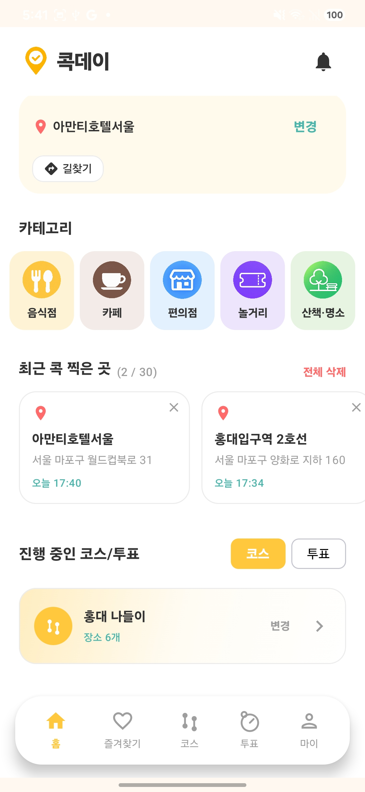 | 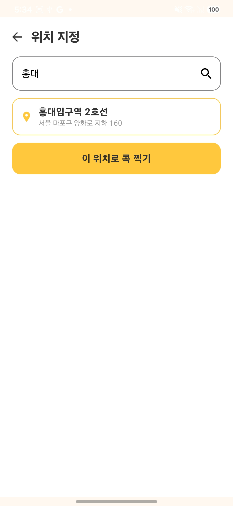 | 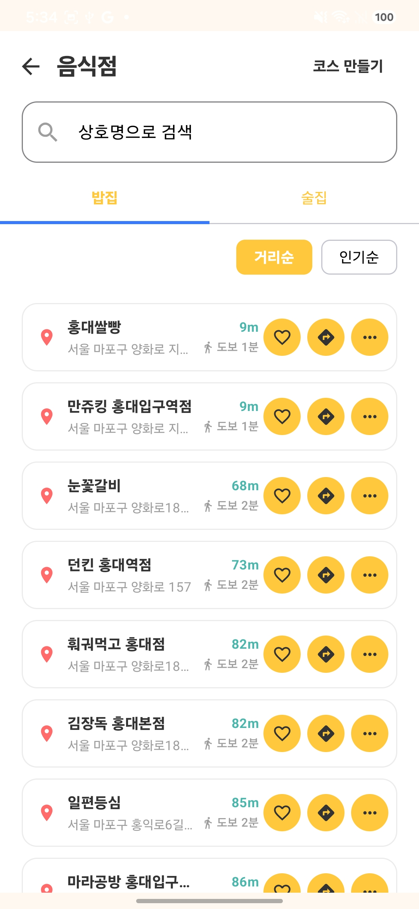 |

| 로그인 | 길찾기 | 즐겨찾기 |
|:---:|:---:|:---:|
| 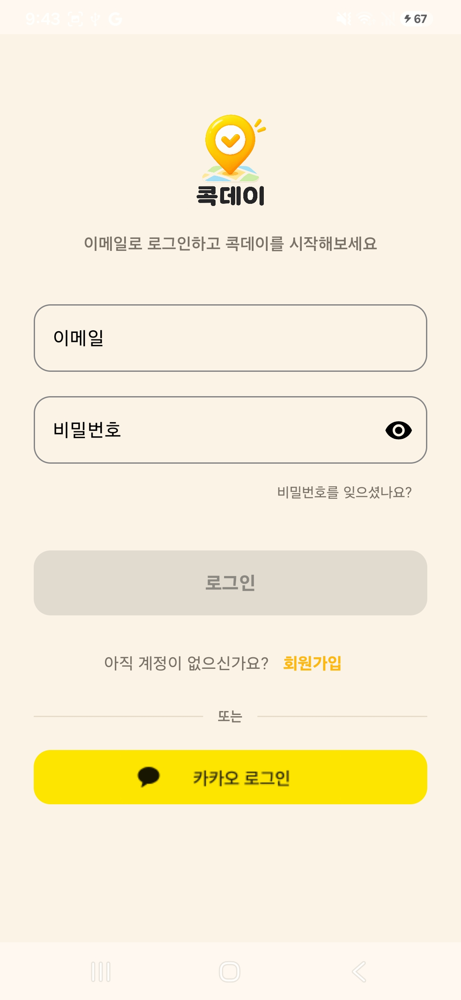 | 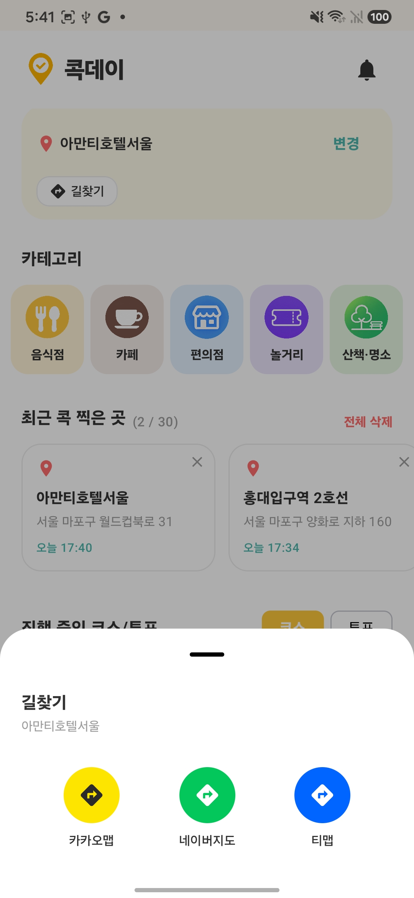 | 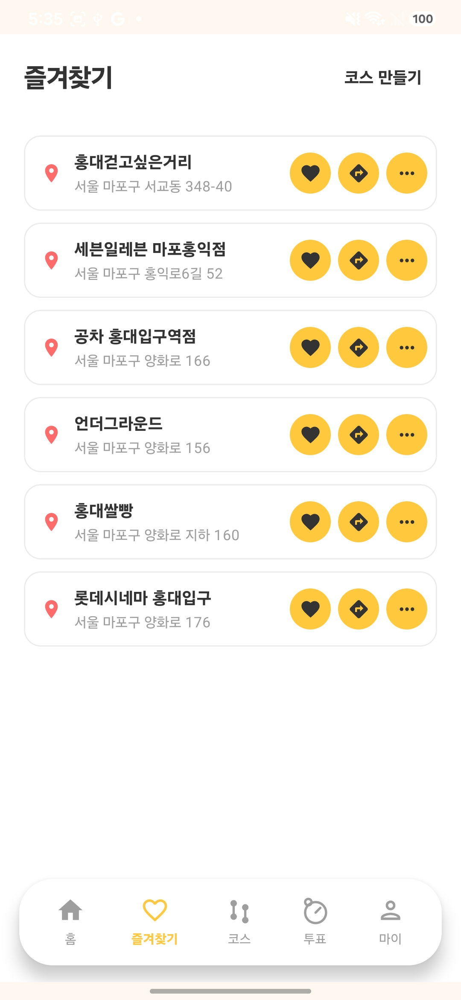 |

| 카테고리 더보기 | 코스 | 코스 투표 |
|:---:|:---:|:---:|
| 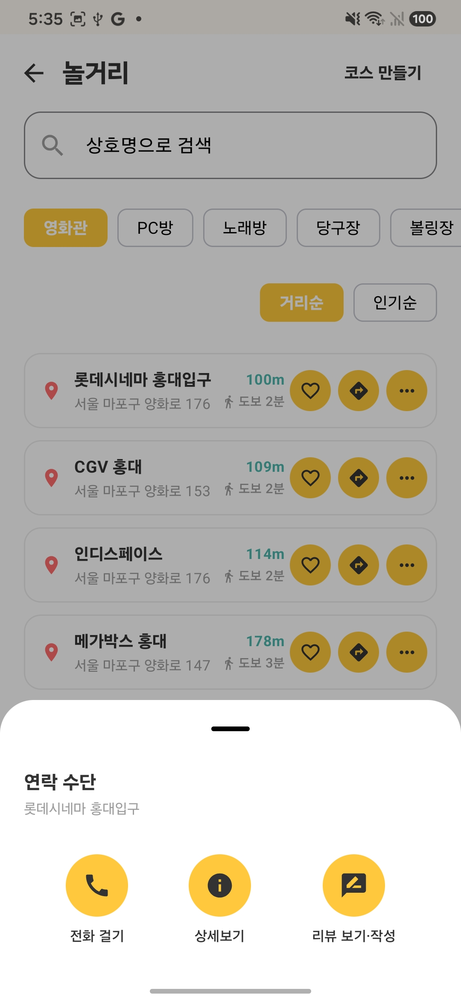 | 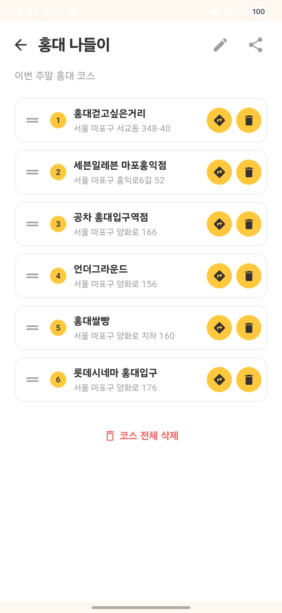 | 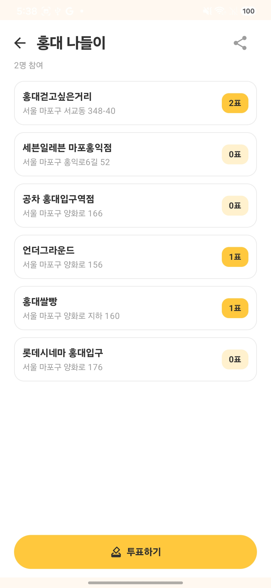 |

| 웹에서 코스 투표1 | 웹에서 코스 투표2 | 내가 만든 코스 이미지 변환 |
|:---:|:---:|:---:|
| 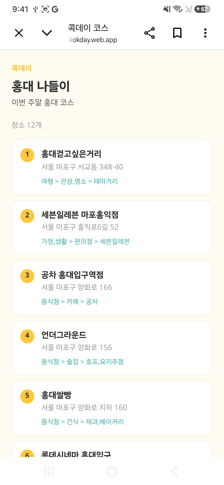 | 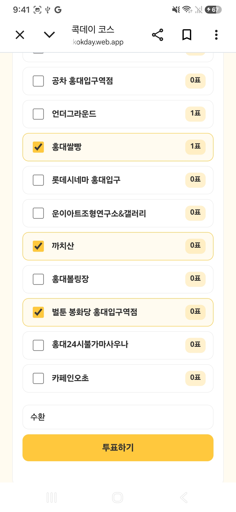 | 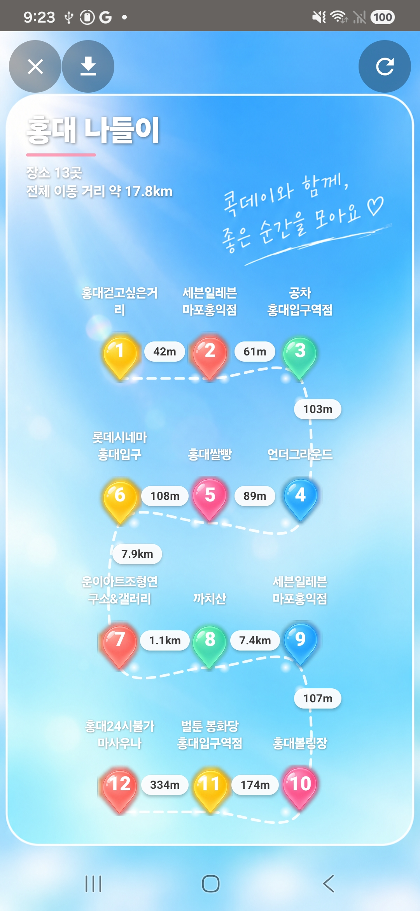 |


